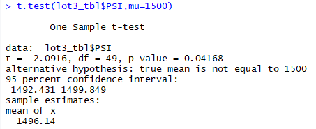

# MechaCar Statistical Analysis
AutosRUs newest prototype is the MechaCar. Unfortunately, the MechaCar is suffering from production troubles that are blocking the manufacturing team's progrsss. Production data for 50 prototype MechaCars regarding vehicle length, vehicle weight, spoiler angle, ground clearance, AWD and MPG were provided to perform data analysis to help the manufacutirng team gain insight into the production delays.

# Results
## Deliverable #1 - Linear Regression to Predict MPG
### Which variables/coefficients provided a non-random amount of variance to the mpg values in the dataset?

The p value shown in column "Pr (>|t|)" helps determine whether the relationships observed in the sample also exist in the larger population. It helps test the null hypothesis that the variable (vechicle length, vehicle weight, spoiler angle, ground clearance and AWD) has no correlation with dependent varialble (MPG). We assumed an acceptable p value should have a significance level of 0.05 indicating a 5% risk of the model or rather the coefficient being incorrect or unable to predice the dependent varaible. 

The summary of the calculated linear regression model shows that the vehicle length, ground clearance and the Intercept have a much smaller value than 0.05 which would indicate that the null hypothesis for those variable can be rejected. These variables are probably not random.

* Is the slope of the linear model considered to be zero? Why or why not?

The slope of the linear model is not zero because the P-value for the intercept is far smaller than the declared significance level of 0.05. This means the intercept is not zero and is significantly impactful in regards to the MPG.

* Does this linear model predict mpg of MechaCar prototypes effectively? Why or why not?
Linear Models that have an R-Squarded value of 0.70 or greater are considered effective models. The R-Squarded value, highlighed in yellow, is 0.071.

## Deliverable #2 - Summary Statistics on Suspension Coils
### Total Summary

### LoT Summary

The design specifications for the MechaCar suspension coils dictate that the variance of the suspension coils must not exceed 100 pounds per square inch. Does the current manufacturing data meet this design specification for all manufacturing lots in total and each lot individually? Why or why not?

Lot 1 and 2 seems to meat the Mean specification of 1500, but Lot 3 is a little bit shy of it.

## Deliverable #3 - T-Tests on Suspension Coils

Our null hypothesis = Mean is 1500 and our alternative hypothesis = Mean is not 1500. 

Our level significance is 0.05. Lot 1 and Lot 2 have a p-value of 0.06028 and 1, respecitively. Therefore, we cannot reject the null hypothesis. Lot 3, with a p-value of 0.04168 which is less than 0.05, therefore, we can reject the null hyothesis for Lot 3.

### T-Tests Across All Manufacturing Lots

### T-Tests Across Manufacturing Lot 1 Only

### T-Tests Across Manufacturing Lot 2 Only

### T-Tests Across Manufacturing Lot 3 Only

## Deliverable #4 - Study Design: MechaCar vs Competition
To properly compare the MechaCar with other competitive cars, the metrics of most interests to consumers would be city vs highway gas mileage,  safety rating, price, and  the number of passengers it can carry. Some this data will need to be aggregated in a manner that makes the comparison equal. For example, rather than just the price tag, compare the price tag per cubic feet of space.

Null & Alternative Hypothesis
Ho = vehicle size has zero or no significant effect on car price
Ha = the price of cars increase when vehicle size increase

We would run a multiple linear regression analysis and summary for mileage, safety rating, and # of passengers with regards to how it affects price since there are 2+ independent variables to review against 1 dependent variable. From there, we can review the P-Value for each variable and determine the significance of that variable against a significance level of 0.05. Anythiny under 0.05 will require us to reject the null hypothesis.

We will need safety ratings, price, citg MPG, highway MPG, price and number of passengers catogorized by car model and year. We would require data for the past 3 years in case we need to further analyze whether trench for particular car types have changed over the year. If that is the case, prices of cars may also be dependent on social trends instead of actual physical car qualities.

